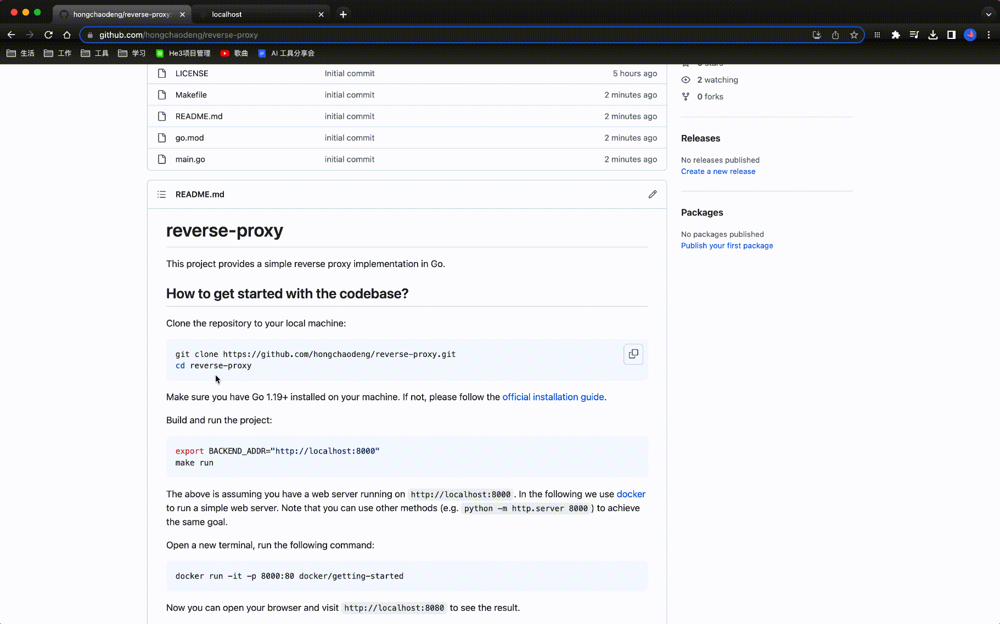

# reverse-proxy

This project provides a simple reverse proxy implementation in Go.

## How to get started with the codebase?



Clone the repository to your local machine:

```bash
git clone https://github.com/hongchaodeng/reverse-proxy.git
cd reverse-proxy
```

Make sure you have Go 1.19+ installed on your machine. If not, please follow the [official installation guide](https://go.dev/doc/install).

Build and run the project:

```bash
export BACKEND_ADDR="http://localhost:8000"
make run
```

The above is assuming you have a web server running on `http://localhost:8000`.
In the following we use [docker](https://docs.docker.com/engine/install/) to run a simple web server.
Note that you can use other methods (e.g. `python -m http.server 8000`) to achieve the same goal.

Open a new terminal, run the following command:

```bash
docker run -it -p 8000:80 docker/getting-started
```

Now you can open your browser and visit `http://localhost:8080` to see the result.

## What resources used to build my implementation?

## What design decisions I made, including limitations of the system?

## How to scale this?

## How to make it more secure?


In your readMe, answer the following questions:

Q: How could someone get started with your codebase?


Q: What resources did you use to build your implementation?
A: 

Q: What are the design decisions you made, including limitations of the system.
A:
- single backend
- limited routing logic
- no middleware support
- no retry
- limited security measures
- no support for websockets or other non-http protocol

Q: How would you scale this?
A: 

Q: How would you make it more secure?
A: TLS encryption, authentication, authorization, etc.